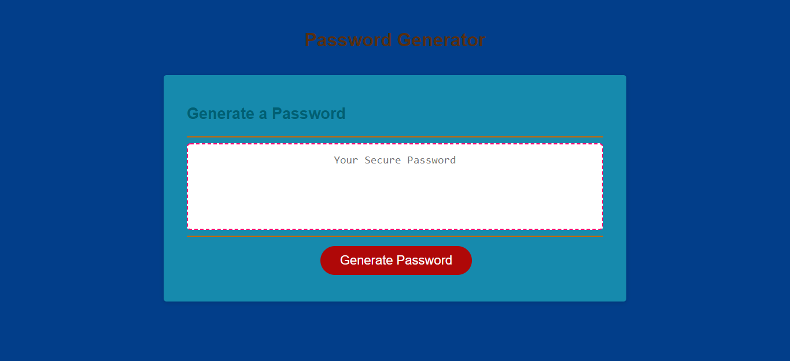

# Password_Generator

**User Story**

AS an employee with access to sensitive data
------
I WANT  : To randomly generate a password that meets certain criteria
------
SO THAT : I can create a strong password that provides greater security
------

**Goal**

To refactor the starter code to create a password generator so that it satisfy the below given acceptance criteria.

**Acceptance Criteria**

The goal to refactor the provided code to create password generator will be met when :

*When user click the button to generate a password*

**(1)User should be prompted to choose the length of the password between 8 to 128 character.**
------
It's considered done 
------
WHEN : prompt method with the message inside is used and the user input is 
       stored in a variable.

**(2)User should be asked to confirm wether to include lower-case letter in password.**
------
It's considered done 
------
WHEN : all the lower case alphabets are stored as a single string in a 
       variable. 
WHEN : a variable (passwordChar) with an empty string is declared. 
WHEN : confirm() method with the message inside is used and stored in a 
       variable. 
WHEN : an if-statement is written for user input to be true. 
WHEN : variable with lower-case string is added to 'passwordChar'.

**(3)User should be asked to confirm wether to include upper-case letter in password.**
------
It's considered done 
------
WHEN : all the upper case alphabets are stored as a single string in a 
       variable. 
WHEN : confirm() method with the message inside is used and stored in a 
       variable. 
WHEN : an if-statement is written for user input to be true. 
WHEN : variable with upper-case string is added to 'passwordChar'.

**(4)User should be asked to confirm wether to include any number in password.**
------
It's considered done 
------
WHEN : numbers from 0 to 9 are stored as a single string in a 
       variable. 
WHEN : confirm() method with the message inside is used and stored in a 
       variable. 
WHEN : an if-statement is written for user input to be true. 
WHEN : variable with numbers string is added to 'passwordChar'.

**(5)User should be asked to confirm wether to include any special character in password.**
------
It's considered done 
------
WHEN : all the special characters are stored as a single string in a 
       variable. 
WHEN : confirm() method with the message inside is used and stored in a 
       variable. 
WHEN : an if-statement is written for user input to be true. 
WHEN : variable with special characters string is added to 'passwordChar'.

**(6)When user answer each prompt,then a password is generated that matches the selected criteria**
------
It's considered done 
------
WHEN : an if-statement is written with a conditional statement about the 
       length of the password. 
WHEN : by using Math.random() inside the if statement, random number is 
       generated as per the length of 'passwordChar'. 
WHEN : passwordChar.charAt() method is used on the generated random number. 
WHEN : a variable 'password' with an empty string is declared globally. 
WHEN : passwordChar.charAt() result is stored in variable 'password'.

*Deployed application should look like the below given image*

*GitHub URL to the repository*
------
https://github.com/Amit-Ranjan22/Password_Generator.git
------

*URL to the deployed application*
------

------